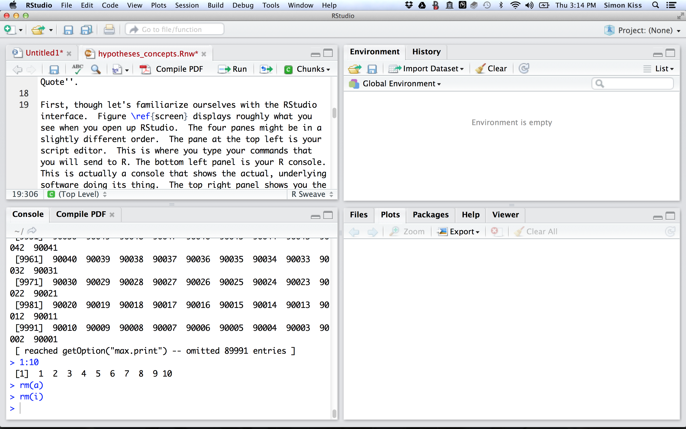

# Introduction
Although it can be challenging, some recent innovations have lowered the learning curve.  RStudio is an example. While R is the underlying statistical software, RStudio is an Integrated Development Environment (IDE) for R.  It provides features such as the capability to view help files, plots, and the workspace environment on the same screen in which you are scripting, minimizing the need to switch back and forth between screens.  It also offers a Graphical User Interface (GUI) set of menu options to perform some basic tasks such as opening and saving scripts and opening and saving your workspace.

The image below displays roughly what you see when you open up RStudio.  The four panes might be in a slightly different order.  In order to get this, you might have to select File > New File > R Script from the menu option. 

 

Once you do that, the panel at the top left is your script editor.  This is where you type your commands that you will send to R. Think of it like a painter's sketch pad; you try out some different ideas and when you like them, you put the ideas onto the actual canvas.  

In R, there are multiple ways to execute commands from your script.  The best way is to hit `shift-CMD-S`, which runs your entire script file sequentially. Alternatively, you can hit `ctl-CMD-B` to run all the lines up to where your cursor is. Lastly, you can send commands line-by-line (the cursor's position dictates which line is executed) or you can selected a section of lines and run that code. Both work by entering `CMD-return`.  

The top right panel shows you the workspace you are working in and the bottom right panel shows you a combination of things, primarily it shows you any graphs you produce (plots) and help files you want to read.


```{r setup, echo=F, results='hide'}
knitr::opts_chunk$set(echo = TRUE, message=F, warning=F, fig.align='center', results='markup')
```
Commands in R take the form of `command(x,y)`
with arguments like x and y to each command inside the parentheses.  See what happens when you type the following in your script editor and then press `CMD-Return` (or `CNTL-ENTER`)

```{r print-example}
print('Hello world')
```
The results of any command can be saved with R's assignment operator ` <- `. The objects on the left receive --  and become aliases for -- what is on the right.  It's an awkward thing it's true: one way to make it easier to remember is to interpret strings with the operator as left gets right.  So in the following command object `abc` gets the results of `print(hello world)`. 

```{r save-objects}
abc<-print('Hello world')

```

```{r print-saved-objects}
abc
```

# How to install packages. 

Packages are installed with the function `install.packages()`. We installed the necessary packages prior to this course. 

```{r install-tidyverse, eval=F}
install.packages('tidyverse')
```

Installation is only ever required once. *Loading* them into working memory is a different story, however. These are loaded with `library()`, as necessary. 

# Basics of the R language}
## Base R and the tidyverse
There have been some remarkable and important innovations inside R recently that have improved thr language, made it more powerful and more user-friendly.  These are a set of packages designed by Hadley Wickham of the University of Auckland and RStudio.  Collectively this set of pakckages has come to be known as the tidyverse. Wickham uses the term 'tidy' to refer to data that is stuctured such that each row is an observation and each column is a variable. There is a particular logic associated with the tidyverse that makes it worthwhile to mark it off from what is known as base R. 

Running `library(tidyverse)` will load the following packages:

1. `ggplot2`, for data visualisation.
2. `dplyr`, for data manipulation.
3. `tidyr`, for data tidying.
4. `readr`, for data import.
5. `purrr`, for functional programming.
6. `tibble`, for tibbles, a modern re-imagining of data frames.


```{r load-tidyverse}
library(tidyverse)
```


And then, we'll need a few more libraries from base R to do our work.  

## Data Types 

There are multiple types of data within the R environment and we'll start by working through some of the different ways that data are stored.

### Numeric
Numbers are stored as `numeric' data.
```{r numeric}
num<-1

```
### Character
Character strings (e.g. letters and numbers stored as characters, not numbers) have to be single-quoted. Note, in general it's best to use single-quotes when dealing with single strings.  

```{r character}
char<-'1'
```

You can compare what both look like by printing both to the screen. 
```{r num-char}
num
char
```
You can also use the `class()` command to check what class an object is.

```{r check-class}
class(num)
class(char)
```

### Vectors
Objects of the same class can be stored in a vector of objects. Vectors are formed with the `c()` command (e.g. concatenate), using commas to separate each element in the vector.

```{r make-vectors}
gender<-c(0,1,0)
age<-c(18,22,33)
lucky<-c(1,2,3)
```

### Matrices
Matrices are combinations of numeric vectors (and only numeric vectors) in rows and columns.  They can be formed with the command `matrix()`.


#### Assignment 1
>1. Combine `age`, `gender`   and `lucky`  into one matrix called `matrix1`   with 3 columns and n rows using the `matrix()`   command, the `ncol=` and/or the `nrow=`  arguments.** 

```{r assignment-1-solution, results='hide'}
matrix1<-matrix(c(age, gender, lucky), nrow=3, ncol=3)

```

R has a powerful way of accessing elements inside vectors and matrices. With single dimension matrices (i.e. vectors), a number inside square brakcets `[i]` returns the ith element of that vector.  

#### Assignment 2
> 1. Get your own age from `age`. Get your own gender from `gender`. The trick is just remembering where in order of ages and genders yours were stored in.

```{r assignment-2-solution, results='hide' }
#The number in the square brackets indicates which element of the vector gender to return 
age[1]
gender[1]
```

In two-dimensional matrices (i.e. matrices that have rows and columns) the first position in the square brackets returns the row and the second position in the square brackets returns the columns. A comma separates the two. If you leave either the row or the column empty, R returns the whole row or column. *This is an important convention in R and I'm not aware of any function or command where this is reversed: first rows, then columns.*  


#### Assignment 3

> 1. Get the first row of `matrix1`
2. then get the second row 
3. Then return the first column of `matrix1`

```{r assignment-3-solution, eval=F}
matrix1[1,]
matrix1[2,]
matrix1[,1]
```

You can also get a range of `consecutive` columns with the `:` notation.  And you can get a selection of columns with a vector of columns, by using the `c()` argument inside the square brackets (i.e. `c(4,6)`). 

#### Assignment 4

>1. Return the first through third columns of `matrix1`.  
2. Return the first and third columns of `matrix1`. 

```{r assignment-4-solution}
#First through third
matrix1[1:3,]
#first and third
matrix1[c(1,3),]

```

### Data Frames

Data frames are special types of matrices.  They are also stored in rows and columns, but they allow for mixing classes of variables (i.e. numeric and character vectors can be stored alongside each other).  They also explicitly assign variable *names* to columns. These can be accessed with the `$` immediately following the data frame's name, rather than just the column number. 

*Put more glibly, matrices have rows and columns of numbers; data frames have observations (in the rows) and variables (in the columns).*

data frames are constructed with the command `data.frame(variable_name=variable, variable_name=variable)`.

#### Assignment 5
>1. Make a data frame called `df` with the variables `age`, `gender` and `lucky` from the vectors we defined above `age`, `gender` and `lucky`.

```{r assignment-5-solution}
df<-data.frame(age=age, gender=gender, lucky=lucky)
```

You can access individual variables in a data frame with the $.

```{r access-individual-variables}
df$age
df$gender
```

One of the most important things to do on creating a data frame or reading data into R is to inspect it to get a feel for it.  The following commands are useful and should be used often!

```{r summary-commands}
#summarize the first few rows of a data frame
head(df)
#Examine the structure of a data frame
str(df)
#Summary statistics of a data frame.
summary(df)
#Access one variable of a data frame
df$age
```

You can also check the class of each individual variable. 

```{r individual-variables}
#Check class of each variable
class(df$age)
class(df$gender)
class(df$lucky)
```
### Factors

Factors are particular types of character vectors.  Factors are R\'s term for categorical variables.  Storing character vectors as factors allows the user to instruct R to treat it like a categorical variable. The key attribute that factor have is levels, which are like the value labels in SPSS.  There is a key difference between SPSS value labels and factor levels, however, which we will return to below.

In our example of `genders` and `ages`, we want to convert the 1s in the gender variable to female and the 0s to males.  car's `Recode()` command is the ticket.  It is one of the most versatile and frequently used packages in R. Get used to it, quickly!

```{r load-car}
library(car)
```

```{r Recode-gender}
Recode(df$gender, "0='male' ; 1='female'", as.factor=TRUE)
```
```{r Recode-gender-2}
df$gender2<-Recode(df$gender, 
                   "0='male' ; 1='female'", 
                   as.factor=TRUE)
```

You can check the levels of a factor with the `levels()` command. 
```{r check-levels-gender-2}
levels(df$gender2)

```

### Lists 

Lists are collections of data types. They are useful when you want to perform the same function on several items (i.e.a `for` loop).
```{r make-lists}
list1<-list(age, gender,lucky)

```
### Converting classes

Quite often you will want to change a data type's class. There is a series of functions that start with `as.` that converts a class to what follows `as.`.
```{r change-classes}
#print the numeric variable num as a character
as.character(num)
#print the character variable char as a number
as.numeric(char)
#Convert both to a factor (categorical variable)
as.factor(num)
as.factor(char)
```
# Mathematical Operations

Of course, R comes with a full suite of mathematical functions.

```{r maths}
#Addition
x<-1+2
x
y<-2+1
#Division
x/y
#Multiplication
x*y
#Exponentiation
x^2
#Square Root
sqrt(9)

#Use brackets as in regular math
(x+1)/y
```
# Functions 
## Built-in Functions

R brings with it a whole suite of built-in functions. 

```{r calculate-mean}
#Calculate mean
mean(age)
#Calculate median
median(age)
#get the maximum values
max(age)
```

## Custom Functions
Writing functions in R is quite simple and can make your life incredibly easy. 

```{r function-examples, eval=F}
#Note: the capitalization patterns for functions. 
#Words are not separated with periods or underscores, but with capitalized names.
#The arguments that each function takes are specified in parentheses.  
functionName<-function(x,y,z){ #The actual commands are opened with a curly brace command 
  #The function commands are entered here
}# The function is closed here

```

#### Assignment 6

>1. Write a function that takes one argument, squares itself, divides by 3 and then prints the result. 


```{r assignment-6-solution}
#Defie the function
myfunction<-function(i) {
  #square i
  i<-(i^2)/3
  print(i)  
}
#Print the number 7
myfunction(7)

```


